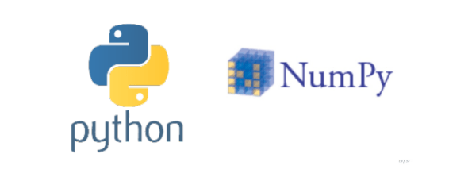
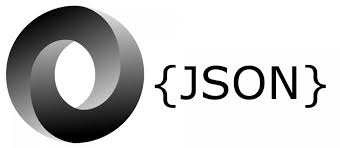

# Python Project - Suicide rates overview

## Overview

Our project is to uncover trends and patterns in suicide rates in 1985 to 2016. We
will examine relationships between suicide rates and age, gender, climate, GDP;
trends in suicide rates over the years; and related questions, as the data admits.

## Data Description

This compiled dataset pulled from four other datasets linked by time and place, and
was built to find signals correlated to increased suicide rates among different
cohorts globally, across the socio-economic spectrum.
https://www.kaggle.com/russellyates88/suicide-rates-overview-1985-to-2016.

The datasets includes the following information that we can use to analyze factors
related to suicide rates:

- Years 
- Age Group 
- Gender 
- Country/Location 
- GDP 

## Methods Used

- **Pandas, Numpy:**

Restructured raw data and performed scientific computing for analysis\

- **Matplotlib:**

Visualized analysis results and plotted findings using line chart, bar plot, scattered
plot and Google Heatmap

- **API, JSON, Python Requests:**

Retrieved coordinates from Google Map using API and imported into the DataFrame

- **Data Modeling:**

Analyzed output using line of best fit (linear/non-linear regression model) and
statistical testing

## Reference

United Nations Development Program. (2018). Human development index (HDI).

http://hdr.undp.org/en/indicators/137506

World Bank. (2018). World development indicators: GDP (current US$) by
country:1985 to 2016.

http://databank.worldbank.org/data/source/world-development-indicators#

[Szamil]. (2017). Suicide in the Twenty-First Century [dataset].

https://www.kaggle.com/szamil/suicide-in-the-twenty-first-century/notebook

World Health Organization. (2018). Suicide prevention.

http://www.who.int/mental_health/suicide-prevention/en/
